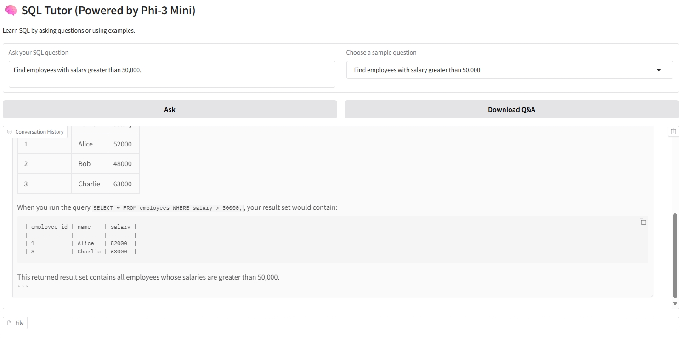

# SQL Tutor App (Powered by Phi-3)

This is a sample work from Dr. Peng, who is passionate about expanding data, ML, AI and software skills. LLM has become a crucial skill for data scientist, and this work applies LLM for data scientists - SQL practising app - which is to help SQL new learners to practice their learnings.

A lightweight, offline-capable SQL tutor powered by a quantized local LLM. Built with Gradio + llama-cpp-python, powered by Phi-3, this tutoring app helps new students learning and practice SQL. The preliminary interface is below:

## Developed Systematically

To be fully reproductible and compatible, Dr. Peng designed following strategies:
- Using Docker to containize the app for other collaborating developers
- Applying Azure APP for deployment

## Future Planning (coming soon)

RAG is crucial for intelligent systems tuning. An RAG-related database will be designed and incorporated to enhance the students' practicing on specific SQL questions (e.g., subqueries, CTE).
